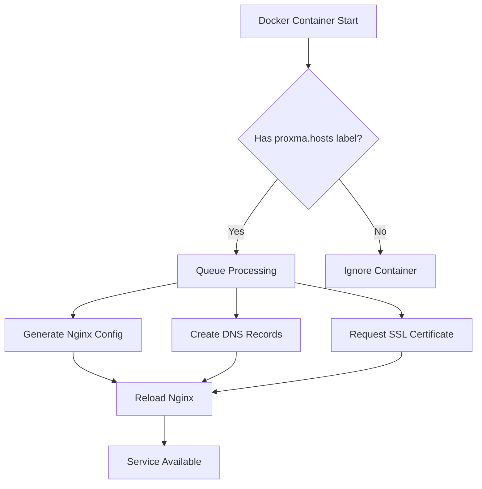

# Proxma 🚀

**Automated Reverse Proxy Management for Docker Containers**

Proxma is a powerful, Rust-based reverse proxy automation tool that automatically configures Nginx reverse proxy rules, manages SSL certificates, and handles DNS records for your Docker containers. Simply add labels to your containers, and Proxma takes care of the rest.

<!-- Project Status & License -->
[](LICENSE)
[](https://github.com/ercindedeoglu/proxma/graphs/commit-activity)
[](https://github.com/ercindedeoglu/proxma/commits)

<!-- Community & Usage -->
[](https://github.com/ercindedeoglu/proxma/stargazers)
[](https://github.com/ercindedeoglu/proxma/network)
[](https://github.com/ercindedeoglu/proxma/issues)

<!-- Docker & Deployment -->
[](https://hub.docker.com/r/dublok/proxma)
[](https://hub.docker.com/r/dublok/proxma)
[](https://hub.docker.com/r/dublok/proxma)

<!-- Technology Stack -->
[](https://www.rust-lang.org/)
[](https://nginx.org/)
[](https://letsencrypt.org/)
[](https://www.cloudflare.com/)
[](https://www.fail2ban.org/)

## 📚 Table of Contents

- [Features](#-features)
- [How It Works](#-how-it-works)
- [Quick Start](#-quick-start)
- [Installation](#-installation)
- [Container Labels Reference](#-container-labels-reference)
- [Environment Variables](#-environment-variables)
- [Usage Examples](#-usage-examples)
- [Advanced Configuration](#-advanced-configuration)
- [Security Features](#️-security-features)
- [Monitoring and Troubleshooting](#-monitoring-and-troubleshooting)
- [FAQ](#-frequently-asked-questions)
- [Development](#-development)
- [Contributing](#-contributing)
- [License](#-license)
- [Support](#-support)

## ✨ Features

- **🔄 Automatic Nginx Configuration** - Watches Docker containers and generates reverse proxy configurations
- **🔒 SSL Certificate Management** - Automated Let's Encrypt and ZeroSSL certificate provisioning and renewal
- **🌐 DNS Integration** - Automatic Cloudflare DNS record management
- **🔐 Authentication Support** - HTTP Basic, Bearer token, or both (ideal for API services)
- **🛡️ Security** - Fail2ban integration for intrusion prevention
- **📊 Protocol Support** - HTTP, HTTPS, gRPC proxying with proper status codes
- **🌐 HTTP/2 Support** - Automatic HTTP/2 enablement for HTTPS connections
- **🔌 WebSocket Support** - Built-in WebSocket proxying with proper headers
- **↩️ Domain Redirects** - Flexible domain redirect management
- **🧹 Orphan Cleanup** - Automatic removal of stale configurations
- **🌍 IDN Support** - International domain names with Punycode conversion
- **🔐 Secure Password Hashing** - bcrypt-based password authentication
- **⚡ High Performance** - Rust-based for minimal resource usage
- **🎛️ Flexible Configuration** - Container labels and environment variables
- **🔍 Debug Support** - Comprehensive logging and debugging capabilities
- **📦 Queue Processing** - Asynchronous task processing for reliability

## 🔄 How It Works

Proxma operates as a Docker event listener that automatically manages your reverse proxy infrastructure:

1. **Container Discovery** - Monitors Docker events for containers with `proxma.*` labels
2. **Configuration Generation** - Creates optimized Nginx server blocks for each service
3. **DNS Management** - Automatically creates/updates DNS records (Cloudflare supported)
4. **SSL Automation** - Requests and manages certificates from Let's Encrypt or ZeroSSL
5. **Security Integration** - Configures fail2ban rules and authentication as needed
6. **Cleanup** - Removes configurations for stopped containers to prevent orphaned configs



## 🚀 Quick Start

### Prerequisites

- **Docker & Docker Compose** - Container orchestration
- **Domain names** - Pointing to your server's IP address
- **Ports 80 & 443** - Available for HTTP/HTTPS traffic
- **Cloudflare account** (optional) - For automated DNS management
- **Email address** - For SSL certificate registration

### System Requirements

- **Memory**: 512MB RAM minimum (1GB recommended)
- **CPU**: 1 CPU core minimum
- **Storage**: 1GB for configurations and certificates
- **Network**: Internet access for certificate validation

## 💾 Installation

### Method 1: Docker Compose (Recommended)

1. **Create a `docker-compose.yml` file:**

```yaml
services:
  proxma:
    image: dublok/proxma:latest
    container_name: proxma
    ports:
      - "80:80"
      - "443:443"
    environment:
      - PROXMA_SSL=true
      - PROXMA_SSL_EMAIL=your-email@domain.com
    volumes:
      - /var/run/docker.sock:/var/run/docker.sock
      - proxma_conf:/etc/nginx/conf.d
      - certificates:/etc/certificates
    restart: always

  # Example application
  myapp:
    image: nginx:alpine
    container_name: myapp
    labels:
      proxma.hosts: "myapp.example.com"
      proxma.port: "80"
    restart: always

volumes:
  proxma_conf:
  certificates:
```

2. **Start the services:**

```bash
docker-compose up -d
```

3. **That's it!** Proxma will automatically:
   - Create an Nginx reverse proxy configuration for `myapp.example.com`
   - Request an SSL certificate from Let's Encrypt
   - Configure secure HTTPS proxying

### Method 2: Docker Run

```bash
docker run -d \
  --name proxma \
  -p 80:80 \
  -p 443:443 \
  -e PROXMA_SSL=true \
  -e PROXMA_SSL_EMAIL=your-email@domain.com \
  -v /var/run/docker.sock:/var/run/docker.sock:ro \
  -v proxma_conf:/etc/nginx/conf.d \
  -v certificates:/etc/certificates \
  --restart always \
  dublok/proxma:latest
```

### Method 3: Build from Source

```bash
git clone https://github.com/ercindedeoglu/proxma.git
cd proxma
docker build -t proxma:local .
# Use proxma:local in your docker-compose.yml
```

## 📋 Container Labels Reference

Configure your containers using these labels:

### Core Configuration

| Label | Description | Example |
|-------|-------------|---------|
| `proxma.hosts` | Comma-separated list of domains | `"app.com,www.app.com"` |
| `proxma.port` | Container port to proxy to | `"80"` |
| `proxma.redirects` | Domain redirects (from>to) | `"app.com>www.app.com"` |

### Advanced Host Configuration

Support for per-host port, protocol, and DNS settings:

```yaml
labels:
  # Format: domain:port:protocol:proxied
  proxma.hosts: "api.example.com:8080:http:false,grpc.example.com:9000:grpc:true"
```

### SSL Configuration

| Label | Description | Default |
|-------|-------------|---------|
| `proxma.ssl` | Enable SSL for this container | `false` |
| `proxma.ssl.email` | Email for certificate registration | - |
| `proxma.ssl.staging` | Use Let's Encrypt staging | `true` |
| `proxma.ssl.provider` | Certificate provider (`letsencrypt`, `zerossl`) | `letsencrypt` |

### DNS Management

| Label | Description | Example |
|-------|-------------|---------|
| `proxma.dns.provider` | DNS provider (`cloudflare`) | `"cloudflare"` |
| `proxma.dns.target` | DNS record target | `"proxy.example.com"` |
| `proxma.dns.type` | DNS record type | `"CNAME"` |
| `proxma.dns.proxied` | Enable Cloudflare proxy | `true` |

### Authentication

| Label | Description | Default | Example |
|-------|-------------|---------|---------|
| `proxma.auth` | Enable authentication | `false` | `true` |
| `proxma.auth.type` | Auth type: `basic`, `bearer`, or `both` | `"basic"` | `"bearer"` |
| `proxma.auth.username` | Username (for `basic`/`both`) | `"root"` | `"admin"` |
| `proxma.auth.password` | Password (for `basic`/`both`) | `"root"` | `"secure123"` |
| `proxma.auth.token` | Static bearer token (for `bearer`/`both`) | - | `"my-api-key"` |
| `proxma.auth.realm` | Auth realm (browser prompt text) | `"Restricted Area"` | `"Admin Panel"` |

### Web Server Tuning

| Label | Description | Default |
|-------|-------------|---------|
| `proxma.webserver.client_max_body_size` | Max request body size | `"100m"` |
| `proxma.webserver.client_body_timeout` | Client body timeout | `"100s"` |
| `proxma.webserver.client_header_timeout` | Client header timeout | `"100s"` |
| `proxma.webserver.send_timeout` | Send timeout | `"30s"` |
| `proxma.webserver.keepalive_timeout` | Keep-alive timeout | `"400s"` |
| `proxma.webserver.proxy_connect_timeout` | Proxy connect timeout | `"15s"` |
| `proxma.webserver.proxy_send_timeout` | Proxy send timeout | `"30s"` |
| `proxma.webserver.proxy_read_timeout` | Proxy read timeout | `"100s"` |

### SSL DNS Configuration

| Label | Description | Example |
|-------|-------------|---------|
| `proxma.ssl.dns.provider` | SSL DNS challenge provider | `"cloudflare"` |

### Cloudflare Credentials (Container Level)

| Label | Description |
|-------|-------------|
| `proxma.cloudflare.email` | Cloudflare account email |
| `proxma.cloudflare.api_key` | Global API Key |
| `proxma.cloudflare.api_token` | API Token (recommended) |

## 🌍 Environment Variables

Configure Proxma globally using environment variables:

### Core Settings

| Variable | Description | Default |
|----------|-------------|---------|
| `PROXMA_SSL` | Enable SSL globally | `false` |
| `PROXMA_SSL_EMAIL` | Default SSL email | - |
| `PROXMA_SSL_STAGING` | Use staging certificates | `true` |
| `PROXMA_SSL_PROVIDER` | Default SSL provider | `letsencrypt` |

> **Note**: Currently only Let's Encrypt is fully implemented. ZeroSSL support is planned for future releases.

### DNS Configuration

| Variable | Description | Example |
|----------|-------------|---------|
| `PROXMA_DNS_PROVIDER` | Default DNS provider | `cloudflare` |
| `PROXMA_DNS_TARGET` | Default DNS target | `proxy.example.com` |
| `PROXMA_DNS_TYPE` | Default DNS record type | `CNAME` |
| `PROXMA_DNS_PROXIED` | Default proxy setting | `false` |

### Cloudflare Credentials

| Variable | Description |
|----------|-------------|
| `PROXMA_CLOUDFLARE_API_TOKEN` | Cloudflare API Token (recommended) |
| `PROXMA_CLOUDFLARE_EMAIL` | Cloudflare account email |
| `PROXMA_CLOUDFLARE_API_KEY` | Cloudflare Global API Key |

### Security

| Variable | Description | Default |
|----------|-------------|---------|
| `PROXMA_DISABLE_FAIL2BAN` | Disable fail2ban | `false` |
| `PROXMA_FORCE_IPV6` | Force IPv6 even if not detected | `false` |
| `PROXMA_AUTH` | Enable auth globally | `false` |
| `PROXMA_AUTH_TYPE` | Default auth type (`basic`, `bearer`, `both`) | `"basic"` |
| `PROXMA_AUTH_USERNAME` | Default username (for `basic`/`both`) | `"root"` |
| `PROXMA_AUTH_PASSWORD` | Default password (for `basic`/`both`) | `"root"` |
| `PROXMA_AUTH_TOKEN` | Default bearer token (for `bearer`/`both`) | - |
| `PROXMA_AUTH_REALM` | Default auth realm | `"Restricted Area"` |

### SSL DNS Provider

| Variable | Description | Example |
|----------|-------------|---------|
| `PROXMA_SSL_DNS_PROVIDER` | SSL DNS challenge provider | `cloudflare` |

### Web Server Defaults

| Variable | Description | Default |
|----------|-------------|---------|
| `PROXMA_WEBSERVER_CLIENT_MAX_BODY_SIZE` | Global max body size | `"100m"` |
| `PROXMA_WEBSERVER_CLIENT_BODY_TIMEOUT` | Global body timeout | `"100s"` |
| `PROXMA_WEBSERVER_CLIENT_HEADER_TIMEOUT` | Global header timeout | `"100s"` |
| `PROXMA_WEBSERVER_SEND_TIMEOUT` | Global send timeout | `"30s"` |
| `PROXMA_WEBSERVER_KEEPALIVE_TIMEOUT` | Global keepalive timeout | `"400s"` |
| `PROXMA_WEBSERVER_PROXY_CONNECT_TIMEOUT` | Global proxy connect timeout | `"15s"` |
| `PROXMA_WEBSERVER_PROXY_SEND_TIMEOUT` | Global proxy send timeout | `"30s"` |
| `PROXMA_WEBSERVER_PROXY_READ_TIMEOUT` | Global proxy read timeout | `"100s"` |

### Debug and Logging

| Variable | Description | Default |
|----------|-------------|---------|
| `PROXMA_DEBUG` | Enable debug logging | `false` |

### SSL Provider Support (Future)

| Variable | Description | Example |
|----------|-------------|---------|
| `PROXMA_SSL_PROVIDER` | SSL certificate provider | `letsencrypt`, `zerossl` |
| `PROXMA_SSL_ZEROSSL_API_KEY` | ZeroSSL API key (when supported) | `your-api-key` |

> **Note**: ZeroSSL support and additional SSL providers are planned features based on configuration examples found in the codebase.

## 📚 Usage Examples

### Simple Web Application

```yaml
services:
  webapp:
    image: nginx:alpine
    labels:
      proxma.hosts: "mysite.com,www.mysite.com"
      proxma.port: "80"
      proxma.redirects: "mysite.com>www.mysite.com"
```

### API with Custom Port and gRPC

```yaml
services:
  api:
    image: myapi:latest
    labels:
      proxma.hosts: "api.example.com:8080:http,grpc.example.com:9000:grpc"
```

### Secure Application with Basic Authentication

```yaml
services:
  admin:
    image: admin-panel:latest
    labels:
      proxma.hosts: "admin.example.com"
      proxma.port: "3000"
      proxma.ssl: "true"
      proxma.auth: "true"
      proxma.auth.username: "admin"
      proxma.auth.password: "secure-password"
```

### API Service with Bearer Token Authentication

```yaml
services:
  api:
    image: my-api:latest
    labels:
      proxma.hosts: "api.example.com"
      proxma.port: "8080"
      proxma.ssl: "true"
      proxma.auth: "true"
      proxma.auth.type: "bearer"
      proxma.auth.token: "your-api-key-here"
```

### Multi-Environment Setup

```yaml
services:
  proxma:
    image: dublok/proxma:latest
    environment:
      - PROXMA_SSL=true
      - PROXMA_SSL_EMAIL=ssl@example.com
      - PROXMA_SSL_STAGING=false  # Production certificates
      - PROXMA_DNS_PROVIDER=cloudflare
      - PROXMA_DNS_TARGET=server.example.com
      - PROXMA_CLOUDFLARE_API_TOKEN=your-token-here
    # ... volumes and ports

  frontend:
    image: frontend:latest
    labels:
      proxma.hosts: "app.example.com"
      proxma.port: "80"
      proxma.dns.proxied: "true"

  api:
    image: api:latest
    labels:
      proxma.hosts: "api.example.com"
      proxma.port: "3000"
      proxma.auth: "true"
      proxma.auth.username: "apiuser"
      proxma.auth.password: "apipass"
```

## 🔧 Advanced Configuration

### Complete Docker Compose Example

```yaml
services:
  proxma:
    image: dublok/proxma:latest
    container_name: proxma
    ports:
      - "80:80"
      - "443:443"
    environment:
      # SSL Configuration
      - PROXMA_SSL=true
      - PROXMA_SSL_EMAIL=certificates@yourdomain.com
      - PROXMA_SSL_STAGING=false
      - PROXMA_SSL_PROVIDER=letsencrypt
      
      # DNS Configuration
      - PROXMA_DNS_PROVIDER=cloudflare
      - PROXMA_DNS_TARGET=your-server.yourdomain.com
      - PROXMA_DNS_TYPE=CNAME
      - PROXMA_DNS_PROXIED=true
      
      # Cloudflare Credentials
      - PROXMA_CLOUDFLARE_API_TOKEN=your-cloudflare-api-token
      
      # Security
      - PROXMA_DISABLE_FAIL2BAN=false
      
      # Web Server Defaults
      - PROXMA_WEBSERVER_CLIENT_MAX_BODY_SIZE=10m
      - PROXMA_WEBSERVER_PROXY_READ_TIMEOUT=300s
    volumes:
      - /var/run/docker.sock:/var/run/docker.sock:ro
      - proxma_conf:/etc/nginx/conf.d
      - certificates:/etc/certificates
      - /etc/timezone:/etc/timezone:ro
      - /etc/localtime:/etc/localtime:ro
    restart: always
    
volumes:
  proxma_conf:
  certificates:
```

### Custom Nginx Configuration

Proxma generates optimized Nginx configurations with advanced features:

```yaml
labels:
  proxma.hosts: "myapp.example.com"
  proxma.port: "8080"
  proxma.webserver.client_max_body_size: "50m"  # Allow large uploads
  proxma.webserver.proxy_read_timeout: "300s"   # 5-minute timeout
  proxma.webserver.proxy_connect_timeout: "10s" # Quick connection timeout
```

**Generated Nginx Features:**
- **HTTP/2** automatically enabled for HTTPS
- **WebSocket support** with proper connection upgrades
- **gRPC support** with error handling and status codes
- **Modern SSL** with TLSv1.2/TLSv1.3 protocols only
- **Comprehensive headers** for upstream compatibility
- **ACME challenges** for certificate validation
- **Security headers** and proper authentication handling

## 🛡️ Security Features

### Fail2ban Integration

Proxma includes built-in fail2ban configuration to protect against:
- HTTP authentication brute force attacks
- Nginx probe attempts
- HTTP error rate limiting

Disable with: `PROXMA_DISABLE_FAIL2BAN=true`

### Authentication

Proxma supports three authentication modes per container:

**Basic Auth** (default) - traditional username/password:

```yaml
labels:
  proxma.auth: "true"
  proxma.auth.username: "secure-user"
  proxma.auth.password: "strong-password"
  proxma.auth.realm: "Protected Application"
```

**Bearer Token Auth** - static token validation, ideal for API services and MCP clients:

```yaml
labels:
  proxma.auth: "true"
  proxma.auth.type: "bearer"
  proxma.auth.token: "my-secret-api-key"
```

Clients authenticate with: `Authorization: Bearer my-secret-api-key`

**Both** - accepts either Basic or Bearer auth (useful for services accessed by both browsers and API clients):

```yaml
labels:
  proxma.auth: "true"
  proxma.auth.type: "both"
  proxma.auth.username: "admin"
  proxma.auth.password: "strong-password"
  proxma.auth.token: "my-secret-api-key"
```

### SSL/TLS

- **Automatic certificate provisioning and renewal**
- **Let's Encrypt support** (ZeroSSL planned for future releases)
- **Staging environment support** for testing
- **Modern SSL protocols** - TLSv1.2 and TLSv1.3 only
- **HTTP/2 automatic enablement** on HTTPS connections
- **ACME challenge handling** for certificate validation

### Advanced Features

- **gRPC Error Handling** - Proper gRPC status codes (UNAUTHENTICATED, UNAVAILABLE, etc.)
- **WebSocket Support** - Automatic WebSocket proxying with connection upgrades
- **International Domains** - IDN support with automatic Punycode conversion
- **Comprehensive Headers** - Full proxy header forwarding for upstream compatibility
- **Password Security** - bcrypt hashing for basic auth, static token validation for bearer auth

## 🔍 Monitoring and Troubleshooting

### Logs

Monitor Proxma activity:

```bash
# View Proxma logs
docker logs proxma

# Follow logs in real-time
docker logs -f proxma

# View nginx logs
docker exec proxma tail -f /var/log/nginx/access.log
docker exec proxma tail -f /var/log/nginx/error.log
```

### Health Checks

Check if services are properly configured:

```bash
# List generated nginx configurations
docker exec proxma ls -la /etc/nginx/conf.d/

# Check nginx configuration syntax
docker exec proxma nginx -t

# View certificate status
docker exec proxma ls -la /etc/certificates/
```

### Common Issues

**Certificate generation fails:**
- Verify domain DNS points to your server
- Check `PROXMA_SSL_EMAIL` is set
- Try staging mode first: `PROXMA_SSL_STAGING=true`

**Nginx configuration errors:**
- Check container labels are properly formatted
- Verify port numbers are valid
- Review Proxma logs for specific errors

**DNS records not created:**
- Verify Cloudflare credentials
- Check domain exists in Cloudflare
- Ensure API token has DNS edit permissions

## ❓ Frequently Asked Questions

### General Questions

**Q: What makes Proxma different from Traefik or Nginx Proxy Manager?**
A: Proxma is written in Rust for performance, focuses specifically on Docker label-based configuration, and includes built-in DNS management and fail2ban security out of the box.

**Q: Can I use Proxma with existing Nginx configurations?**
A: Proxma manages configurations in `/etc/nginx/conf.d/` with the prefix `proxma_`. Your existing configurations in other locations won't be affected.

**Q: Does Proxma support IPv6?**
A: Yes, Proxma supports IPv6 automatically when your Docker setup and DNS records are configured for IPv6.

### SSL/TLS Questions

**Q: How do I use production SSL certificates instead of staging?**
A: Set `PROXMA_SSL_STAGING=false` or use the label `proxma.ssl.staging: "false"`

**Q: Can I use my own SSL certificates?**
A: Currently, Proxma only supports automated certificate provisioning. Manual certificate support is planned for future releases.

**Q: What SSL providers are supported?**
A: Let's Encrypt (default) and ZeroSSL. Set via `PROXMA_SSL_PROVIDER` or `proxma.ssl.provider`.

### DNS Questions

**Q: Do I need Cloudflare for Proxma to work?**
A: No, Cloudflare is only needed for automatic DNS record management. You can manually manage DNS and still use Proxma for reverse proxy and SSL.

**Q: Can I use other DNS providers besides Cloudflare?**
A: Currently only Cloudflare is supported. Route53 support is in development.

### Configuration Questions

**Q: How do I handle containers that use non-standard ports?**
A: Use the format `proxma.hosts: "domain.com:8080"` or set a global `proxma.port: "8080"`

**Q: Can I proxy to external services (non-Docker)?**
A: Not directly. Proxma is designed for Docker containers. For external services, create a simple Docker container that proxies to the external service.

**Q: How do I handle WebSocket connections?**
A: Proxma automatically configures Nginx for WebSocket support with proper `Upgrade` and `Connection` headers. No additional configuration needed.

**Q: Does Proxma support HTTP/2?**
A: Yes, HTTP/2 is automatically enabled for all HTTPS connections using the `http2 on;` directive.

**Q: How does gRPC error handling work?**
A: Proxma provides proper gRPC status codes for errors: UNAUTHENTICATED (16), UNAVAILABLE (14), DEADLINE_EXCEEDED (4), and UNIMPLEMENTED (12) with HTTP 200 responses as required by gRPC specification.

**Q: Can I use international domain names?**
A: Yes, Proxma supports IDN (International Domain Names) and automatically converts them to Punycode for ASCII compatibility.

### Troubleshooting Questions

**Q: Why isn't my container being detected?**
A: Ensure the container has the `proxma.hosts` label. Check `docker logs proxma` for any error messages.

**Q: Certificates aren't being generated. What's wrong?**
A: Verify: 1) Domain DNS points to your server, 2) `PROXMA_SSL_EMAIL` is set, 3) Ports 80/443 are accessible from the internet, 4) Check if you're hitting Let's Encrypt rate limits.

**Q: How do I enable debug logging?**
A: Set `PROXMA_DEBUG=true` in your environment variables to get detailed logging output.

**Q: What are the default authentication credentials?**
A: For basic auth, the default username is `root` and password is `root`. **Always change these in production!** For bearer auth, no default token is set - you must provide one via `proxma.auth.token`.

**Q: My API client only supports Bearer tokens but Proxma uses Basic auth. What do I do?**
A: Set `proxma.auth.type: "bearer"` and `proxma.auth.token: "your-token"` on the container. The client authenticates with `Authorization: Bearer your-token`. Use `proxma.auth.type: "both"` if you need to support both methods.

**Q: How do I migrate from another reverse proxy solution?**
A: 1) Stop your existing reverse proxy, 2) Add Proxma labels to containers, 3) Start Proxma. It will automatically configure everything.

## 📊 Performance and Scaling

### Resource Usage

- **CPU**: ~1-5% on a modern CPU under normal load
- **Memory**: ~50-200MB depending on the number of configured domains
- **Disk I/O**: Minimal, mainly during certificate generation and nginx reloads

### Scaling Considerations

- **Single Instance**: Handles hundreds of domains efficiently
- **Certificate Limits**: Let's Encrypt has rate limits (50 certificates per week per domain)
- **Nginx Performance**: Inherits Nginx's excellent performance characteristics
- **Queue Processing**: Built-in queue system prevents overwhelming external APIs

### Monitoring Recommendations

```yaml
# Add health checks to your docker-compose.yml
services:
  proxma:
    # ... other configuration
    healthcheck:
      test: ["CMD", "nginx", "-t"]
      interval: 30s
      timeout: 10s
      retries: 3
```

### Architecture Details

**Queue Processing System:**
- **Nginx Queue** - Handles configuration generation and reloads
- **Certificate Queue** - Manages SSL certificate requests asynchronously
- **Orphan Cleanup** - Removes stale configurations after container stops
- **Rate Limiting** - Prevents overwhelming external APIs (DNS, SSL providers)

**Configuration Generation:**
- **Domain Sanitization** - Converts domains to filesystem-safe names
- **Template System** - Modular Nginx configuration generation
- **Authentication** - Basic (bcrypt htpasswd), Bearer (nginx auth_request), or both (satisfy any)
- **Protocol Detection** - Automatic HTTP/gRPC/WebSocket handling

## 🚦 Development

### Building from Source

```bash
# Clone the repository
git clone https://github.com/ercindedeoglu/proxma.git
cd proxma

# Build the Docker image
docker build -t proxma .

# Run with development settings
docker-compose -f docker-compose.dev.yml up
```

### Project Structure

```
src/
├── main.rs              # Application entry point
├── docker.rs            # Docker API integration
├── nginx/               # Nginx configuration management
├── dns/                 # DNS provider integrations
├── certbot.rs           # Certificate management
├── queue/               # Task queue system
└── models/              # Data structures
```

## 🤝 Contributing

Contributions are welcome! Please feel free to submit a Pull Request. For major changes, please open an issue first to discuss what you would like to change.

### Development Setup

1. Install Rust: https://rustup.rs/
2. Clone the repository
3. Run `cargo build` to compile
4. Run `cargo test` to execute tests

## 📄 License

This project is licensed under the BSD 3-Clause License - see the [LICENSE](LICENSE) file for details.

## 🙏 Acknowledgments

- [Nginx](https://nginx.org/) - High-performance web server and reverse proxy
- [Let's Encrypt](https://letsencrypt.org/) - Free SSL certificates
- [Cloudflare](https://www.cloudflare.com/) - DNS and CDN services
- [Docker](https://www.docker.com/) - Containerization platform

## 📞 Support

- **Issues**: [GitHub Issues](https://github.com/ercindedeoglu/proxma/issues)
- **Docker Hub**: [dublok/proxma](https://hub.docker.com/r/dublok/proxma)
- **Documentation**: [Project Documentation](docs/)

---

**Made with ❤️ in Rust**